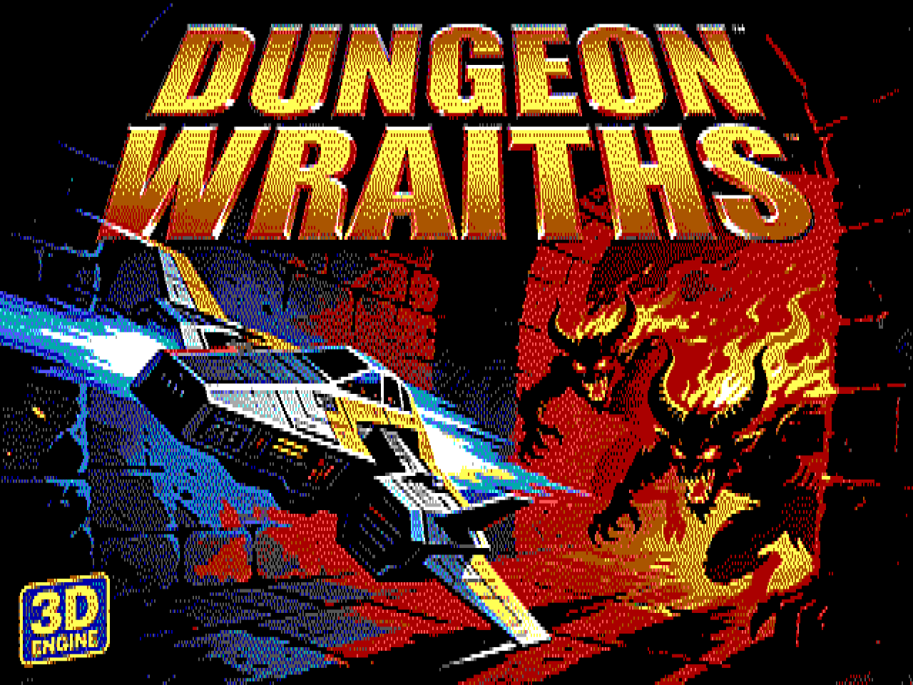

# DeskMind + MindServer



*A Krea 2 picture as DeskMind shows it: dithered to 16 colours at 640x200, stretched here to the 4:3 shape of the Tandy's screen.*

AI chat and AI pictures on a **Tandy 1000 TL/3** (10 MHz 286, 640K, Tandy Video II), in 640x200 with 16 colours.

- **DeskMind** (`C:\DESKMIND\DESKMIND.EXE` on the Tandy) is a DeskMate-style DOS program. You chat with the Qwen AI,
  have it draw pictures, keep a gallery, and play slideshows. It talks over the PicoMEM WiFi to MindServer.
- **MindServer** (`helper\` on this PC) does the heavy work. It runs Qwen (NInfer on the RTX 5090) for chat, prompt
  improvement and looking at pictures, and Krea 2 (ComfyUI on the RTX 4090) for drawing. It dithers each picture to the
  Tandy's 16 colours and sends it over ready to show.
- **SLIDES** (`C:\DESKMIND\SLIDES.EXE`) is a stand-alone slideshow. It needs no network and works in any boot mode.

```
Tandy (boot W) --WiFi, HTTP port 8286--> MindServer (this PC)
                                            |-> NInfer / Qwen    127.0.0.1:1234  (RTX 5090)
                                            '-> ComfyUI / Krea 2 127.0.0.1:8188  (RTX 4090)
```

---

## On the PC: MindServer

### First time only

1. The Python environment is `helper\.venv`. If it's missing, `START-MINDSERVER.bat` prints the two commands that create it.
2. Run **`setup-firewall.bat`** once. It asks for administrator rights and opens TCP port 8286 to the local network only.

### Every time

| Command | What it starts |
|---|---|
| `START-MINDSERVER.bat` | NInfer (Qwen), ComfyUI (Krea 2) and MindServer, each in its own window |
| `START-MINDSERVER.bat noqwen` | ComfyUI and MindServer only. Pictures work, chat doesn't |
| `START-MINDSERVER.bat server` | MindServer only (Dither Lab, tests) |
| `STOP-MINDSERVER.bat` | Stops all three |

A service that already answers is not started twice.

**NInfer needs about 22 GB free on GPU 0**, so start it right after a clean boot, before browsers or games. If Qwen isn't running,
DeskMind says so and names this PC's address. Create can still draw your prompt as typed, without Qwen.

### The MindServer window

| Tab | What it's for |
|---|---|
| **Services** | Status lights for NInfer, ComfyUI and MindServer, start/stop buttons, the log, and which Tandy is connected |
| **Generation** | Krea 2 settings (steps, picture size, LoRA) and a test generation |
| **Dither Lab** | Try dithering settings on any picture: the original beside the Tandy version at the right shape, plus a pixel zoom. Save the settings as the default |
| **Gallery** | The pictures MindServer holds |
| **AI** | Qwen settings and the three instruction texts: chat, prompt improvement, and picture questions (`helper\prompts\*.txt`) |
| **Tandy** | Port, optional token, and the 16-colour palette |

Pictures are kept in `helper\data\images\` (the original PNG plus the Tandy files) and chats in `helper\data\chats\`.

---

## On the Tandy: DeskMind

**Boot with W** (the PicoMEM WiFi boot), then type **`DESKMIND`** at any prompt. `C:\PLAY\DESKMIND.BAT` goes to `C:\DESKMIND`
and starts it. Without WiFi, DeskMind starts offline: the Gallery and slideshow work, Chat and Create don't.

The first time, open **Settings (F5)** and check the MindServer address (this PC's LAN IP, e.g. `192.168.2.192`) and port `8286`.

Options: `DESKMIND /NONET` (start offline), `DESKMIND /NOMOUSE` (keyboard only).

### Keys everywhere

| Key | |
|---|---|
| **F2** Chat, **F3** Create, **F4** Gallery, **F5** Settings, **F6** Slideshow | Switch screens |
| **F10** or **Alt + first letter** | Menus (DeskMind, Chat, Pictures) |
| **Tab / Shift+Tab** | Next or previous control |
| **Enter** | The default (outlined) button |
| **Esc** | Cancel a dialog, or stop a reply or drawing in progress |

Everything also works with the mouse (CuteMouse must be loaded).

### Chat (F2)

- Type and press **Enter** (or Send). The reply streams in. **PgUp/PgDn** and the arrow keys scroll.
- **Ask for a picture in plain words** ("draw a castle at sunset"). Qwen draws it, and the thumbnail appears in the chat.
  **Click a thumbnail** to see it full screen.
- **Picture** attaches a gallery picture to your next message, so you can ask about it ("what's in this picture?"). Qwen sees both the
  original and the 16-colour version. It keeps the latest picture in mind for follow-up questions.
- **Chats** lists the chats saved on this Tandy (newest first) to reopen or delete. **New** starts a fresh chat.
- Every chat is saved as `C:\DESKMIND\CHATS\<id>.TCH` after each reply, and MindServer keeps a copy.
- **Long chats:** when a chat is nearly full, a notice says so. When it's full, Send offers **Continue**, which hides the older
  messages (they stay saved) and goes on, or **New**. A long chat always reopens at its newest part, with a note at the top.

### Create (F3)

1. Describe the picture, in any language and at any length.
2. With **Let Qwen improve my prompt** ticked, Qwen rewrites it into a prompt that dithers well (bold shapes, strong
   contrast). With **Let me edit the improved prompt** ticked, you can change the rewrite before drawing.
3. Krea 2 draws it (about 10 seconds). A progress bar shows each step, and the picture opens full screen.
4. **Again** draws the same prompt with a new seed.

**Enhance rules** (Pictures menu) edits the instructions Qwen follows when it improves prompts. They are saved on MindServer.

### Gallery (F4)

- Grid of thumbnails (6 per page) or a list with dates (**List/Grid** button). Arrows, PgUp/PgDn, Home/End move. **Enter** or a
  double-click views full screen.
- **Rename** changes the title (the file keeps its 8-character ID name). **Delete** removes the picture from the Tandy only.
  **Everywhere** removes it from MindServer too.
- **Ask Qwen** opens Chat with the picture attached.
- **Sync** downloads the pictures MindServer has and the Tandy doesn't (e.g. ones made in the Dither Lab).
- **Slideshow** starts with the selected picture.

### Settings (F5)

| Setting | |
|---|---|
| MindServer address / Port / Token | Where MindServer runs. Set the token only if you set one in the Tandy tab on the PC |
| Sound effects | Tandy sound: start-up chime, reply blip, "picture ready" and error sounds |
| Create: improve my prompt with Qwen | The default for the Create screen |
| Create: let me edit the improved prompt first | The default for the Create screen |
| Chat: also improve prompts of pictures Qwen draws | Better pictures, a few seconds slower |
| Slideshow seconds / Effect / random order | Used by the Gallery slideshow and by SLIDES |

Saved in `C:\DESKMIND\DESKMIND.CFG`.

---

## Slideshows

In DeskMind: **F6**, the Gallery's **Slideshow** button, or Pictures > Slideshow. From DOS: **`SLIDES`**.

```
SLIDES [folder] [/D seconds] [/E effect] [/R] [/NOTITLE] [/ONCE] [/LIST]

  folder     default: DeskMind's PICS folder
  /D n       seconds per picture (default from DeskMind's Settings, else 8)
  /E n       0 random, 1 cut, 2 wipe right, 3 wipe down, 4 blinds, 5 interlace,
             6 dissolve, 7 box out, 8 box in, 9 slide in
  /R         random order
  /NOTITLE   no title strip
  /ONCE      stop after the last picture (default: loop)
  /LIST      print the play order and exit
```

| Key | |
|---|---|
| Space, Enter, Right | Next picture |
| Left | Previous picture |
| P | Pause / go on |
| T | Title strip on / off |
| E | Try the effects one after another |
| Esc, Q, mouse click | Quit |

The title strip shows for 3 seconds. **"7/16" means the 7th-newest of 16 pictures**, the same order as the Gallery, even in
random order.

---

## Limits

Nothing crashes at these limits. DeskMind says when a list is cut short.

| What | Limit | When you reach it |
|---|---|---|
| Pictures in the Gallery | 500 | The newest 500 show, with "Showing the newest 500 of N". Sync stops when the Gallery is full |
| Pictures in SLIDES | 500 | The newest 500 play |
| Pictures in the "attach a picture" list | 200 | The newest 200 are listed |
| Saved chats in the Chats list | 100 | The newest 100 are listed, with "newest 100 of N" |
| One chat on screen | about 40,000 characters, 300 messages | Notice when nearly full. Then Continue (hide the older part) or New |
| Disk | about 68 KB per picture | About 5,000 pictures fit in the free space. Long before that, the Gallery gets slow to open |
| MindServer's memory of a chat | the last 24,000 characters | Qwen forgets the start of very long chats; the transcript is still saved |

---

## Files

| On the Tandy | |
|---|---|
| `C:\DESKMIND\DESKMIND.EXE`, `SLIDES.EXE` | The programs |
| `C:\DESKMIND\DESKMIND.CFG` | Settings |
| `C:\DESKMIND\PICS\<id>.TPI` | Pictures: header, prompt, thumbnail and the full 640x200 picture in one file |
| `C:\DESKMIND\CHATS\<id>.TCH` | Chat transcripts (plain text) |
| `C:\DESKMIND\README.TXT` | Short version of this guide |
| `C:\PLAY\DESKMIND.BAT`, `SLIDES.BAT` | Launchers (made by the games project's `tools\stage.py`) |

---

## Troubleshooting

| Problem | Fix |
|---|---|
| "No network ... DeskMind starts offline" | Boot with **W**. The packet driver only loads in the WiFi boot |
| "MindServer is not answering" | Start `START-MINDSERVER.bat` on the PC. Check the address in Settings, and run `setup-firewall.bat` once |
| "Qwen (NInfer) is not running on the MindServer PC" | Start NInfer after a clean boot of the PC (it needs the 5090's memory), or wait until it has loaded |
| "Not enough memory for the slideshow" | The slideshow needs 64K. Start a new chat or restart DeskMind |
| Colours look off | Brown (colour 6) differs between monitors. Change it in MindServer's Tandy tab. Pictures made after that use it |

---

## For developers

### Building from source

The toolchains aren't in the repository. Put them here first:

| Folder | What | From |
|---|---|---|
| `tools\ow2\` | Open Watcom v2 snapshot (extract the tarball so that `tools\ow2\binnt64\wpp.exe` exists) | github.com/open-watcom/open-watcom-v2 releases |
| `tools\mtcp\mTCP-src_2025-01-10\` | mTCP source 2025-01-10 (compiled in place, never edited) | brutman.com/mTCP |
| `tools\didder\didder.exe` | Optional dither engine for MindServer | github.com/makew0rld/didder |
| `helper\.venv\` | `py -3.13 -m venv helper\.venv`, then `helper\.venv\Scripts\pip install numpy pillow httpx websocket-client PySide6 git+https://github.com/hbldh/hitherdither` | |

MindServer writes `helper\settings.json` the first time you save a setting; it runs on built-in defaults until then.

### Working on it

- Build: `dos\build.bat` (output in `dos\out\`). MindServer tests: `helper\tests\`.
- Install on the card: `tools\card_install.ps1 -Tag <what> -Folder DESKMIND -Files ...` (dated backups, checks, compare).
- Design, protocol and history: `PLAN.md`, `CLAUDE.md`, `TESTING.md`.
- DeskMind includes mTCP, so it is **GPLv3**.
